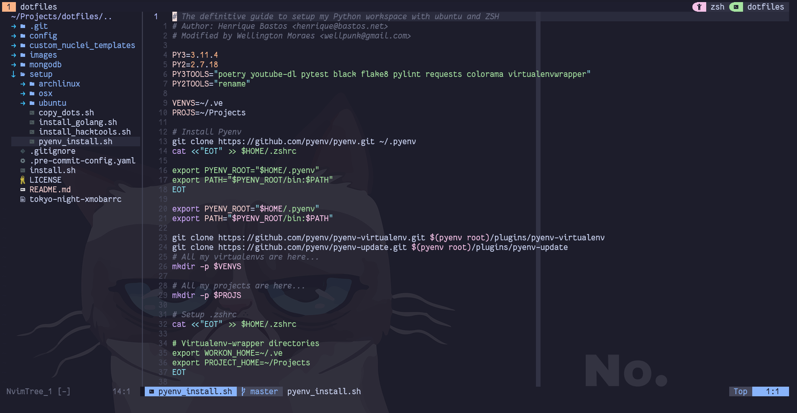

# My neovim config file

<p align="center">
    
</p>

## Install Neovim

```bash
wget -q -O - --no-check-certificate https://raw.githubusercontent.com/LunarVim/LunarVim/rolling/utils/installer/install-neovim-from-release | bash
```

## How to use

### Clone this repo

```bash
git clone https://github.com/mswell/nvim.git ~/.config/nvim
```

and start `nvim` to install all plugins and fun :)

<h6 align="center">
    <a href="https://raw.githubusercontent.com/mswell/dotfiles/master/LICENSE">MIT</a>
    ©
    Wellington Moraes
</h6>
